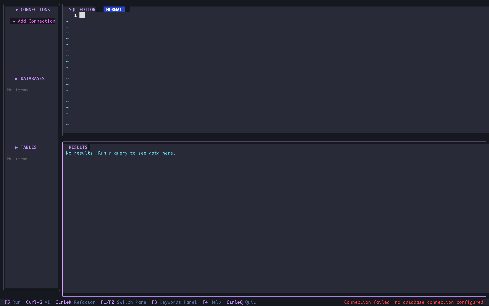

# SQDesk CLI: Modern SQL Client for Terminal
[](LICENSE)
[](https://golang.org)
[](CONTRIBUTING.md)

**SQDesk CLI** is a modern, lightweight, and powerful TUI (Terminal User Interface) SQL Client. Designed for developers who love terminal efficiency but still need a full suite of visual features. Equipped with AI integration to help write and optimize SQL queries.

[🚀 Installation](#-quick-installation) • [📖 Documentation](#-manual-usage-guide) • [✨ Features](#-key-features) • [🪛 Troubleshooting](#-troubleshooting)

---

## 📸 Screenshots

### SQL Editor workspace


### Settings - Style


### AI Integration


### Help Popup (F4)


---

## ✨ Key Features
- **Multi-Database Support** - Native support for PostgreSQL, MySQL, and SQLite.
- **AI-Powered** - Generate SQL from natural language (Text-to-SQL) and automatic query refactoring.
- **Visual Connection Manager** - Easily manage database connections (CRUD) with instant connection testing.
- **Interactive Results** - View query results in interactive tables, copy data, and visualize with charts.
- **Smart Editor** - SQL editor with syntax highlighting and auto-completion.
- **Keywords Panel** - Real-time SQL keyword suggestions as you type.
- **Cross-Platform** - Runs smoothly on macOS, Linux, and Windows (via WSL/Terminal).

## 💻 System Requirements
- **Go** v1.21 or newer
- **Terminal** with True Color support (e.g., iTerm2, Alacritty, VSCode Terminal)
- **Nerd Fonts** (optional, for better icons)

## ⚡ Quick Installation

### One-Liner Install (macOS/Linux)
```bash
curl -fsSL https://raw.githubusercontent.com/febritecno/sqdesk-cli/main/install.sh | bash
```

Or download binary directly:
```bash
# macOS (Apple Silicon)
curl -L https://github.com/febritecno/sqdesk-cli/releases/latest/download/sqdesk-darwin-arm64 -o sqdesk && chmod +x sqdesk

# macOS (Intel)
curl -L https://github.com/febritecno/sqdesk-cli/releases/latest/download/sqdesk-darwin-amd64 -o sqdesk && chmod +x sqdesk

# Linux (x64)
curl -L https://github.com/febritecno/sqdesk-cli/releases/latest/download/sqdesk-linux-amd64 -o sqdesk && chmod +x sqdesk
```

### Using Go Install
```bash
go install github.com/febritecno/sqdesk-cli/cmd/sqdesk@latest
```

### Build from Source
```bash
git clone https://github.com/febritecno/sqdesk-cli.git
cd sqdesk
go build -o sqdesk ./cmd/sqdesk
./sqdesk
```

## 📖 Manual Usage Guide

### 1. Navigation
- **Switch Panel**: Use `F1` (next) and `F2` (previous) to move between Sidebar, Editor, and Results.
- **Sidebar**: Use `↑` and `↓` to select items. `Enter` for actions (Connect, Select DB, Query Table).

### 2. Managing Connections
1. Open Sidebar, select **Connections**.
2. Select **+ Add Connection** and press `Enter`.
3. Fill in connection details in the Settings form.
4. Press `F5` or `Ctrl+S` to **Test Connection**.
5. Press `Enter` to save.
6. To **Edit/Delete**, select an existing connection and press `Enter`.

### 3. Running Queries
1. Write your query in the **Editor**.
2. Press `F5` or `Ctrl+E` to run the query.
3. Results will appear in the **Results** panel.

### 4. AI Features
1. Write a query description in natural language in the Editor.
2. Press `Ctrl+G` to generate SQL.
3. Or, select an existing query and press `Ctrl+K` to refactor/fix the query.

### 5. Important Shortcuts

| Key | Action |
| --- | --- |
| `F1` | Focus next pane |
| `F2` | Focus previous pane |
| `F3` | Toggle Keywords panel |
| `F4` | Show Help (shortcuts) |
| `F5` / `Ctrl+E` | Run Query |
| `Ctrl+G` | AI Generate (Text-to-SQL) |
| `Ctrl+K` | AI Refactor |
| `Tab` | Accept suggestion |
| `c` (in Results) | Copy Selected Row |
| `C` (in Results) | Copy All Data |
| `Ctrl+Q` | Quit |

Press **F4** anytime to see all keyboard shortcuts with pagination.

## 🪛 Troubleshooting

### Connection Failed
- Ensure the database server is running.
- Check the firewall or port being used (default: 5432 for Postgres, 3306 for MySQL).
- Verify username and password.

### Messy Display
- Ensure the terminal supports UTF-8 and True Color.
- Try using a font that supports glyphs (Nerd Fonts).

### AI Not Responding
- Ensure the API Key is set in Settings (`F2`).
- Check your internet connection.

## 🤝 Contributing
Please read [CONTRIBUTING.md](CONTRIBUTING.md) for contribution guidelines.

## 📄 License
This project is licensed under the [MIT License](LICENSE).
